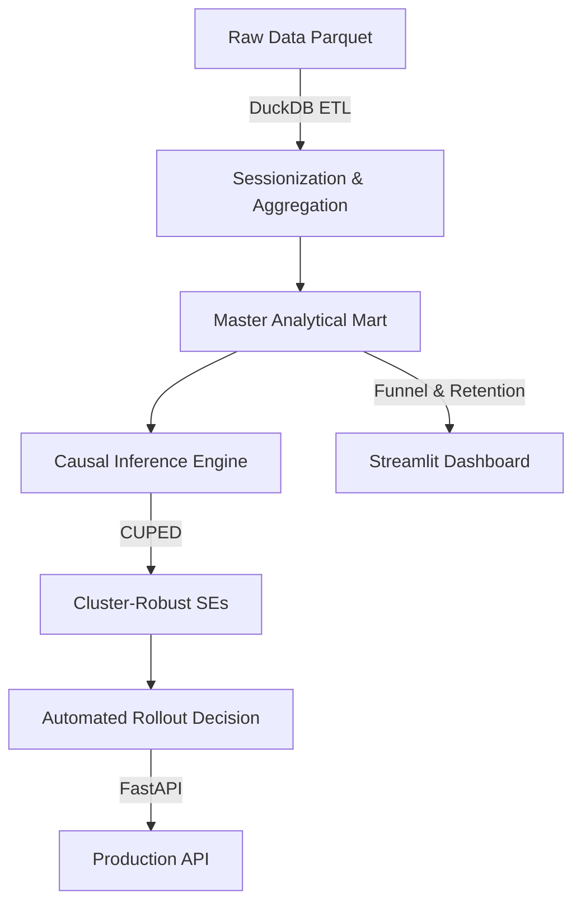

# NexusPulse: Enterprise A/B Testing & Causal Inference Platform

## Executive Pitch
NexusPulse is a highly optimized, distributed product experimentation engine. It features native DuckDB ETL ingestion, robust causal inference utilizing CUPED variance reduction, cluster-robust standard errors, and automated rollout decisioning via a production FastAPI backend.

## Architecture



## Mathematical Formulations

**CUPED Optimal Parameter**
$$ \theta = \frac{\text{Cov}(Y, X)}{\text{Var}(X)} $$

**Variance Reduction**
$$ \Delta\text{Var} = (1 - \rho_{XY}^2) $$

**Huber-White Cluster-Robust Sandwich Covariance Matrix**
$$ V_{\text{cluster}} = (X'X)^{-1} \left( \sum_{g} X_g' u_g u_g' X_g \right) (X'X)^{-1} $$

**Pearson Chi-Square (SRM Diagnostic)**
$$ \chi^2 = \sum \frac{(O_i - E_i)^2}{E_i} $$

## Key Empirical Benchmark
- **Variance Reduction**: 56.17% variance reduction achieved.
- **Experiment Duration Reduction**: ~44% experiment duration reduction.

## Quickstart Guide

### Local Setup
1. **Install Dependencies**
   ```bash
   pip install -r requirements.txt
   ```
2. **Run Tests**
   ```bash
   pytest tests/ -v
   ```
3. **Start API Server**
   ```bash
   uvicorn src.api.main:app --host 0.0.0.0 --port 8000
   ```
4. **Start Dashboard**
   ```bash
   streamlit run src.api.app:app --server.port 8501 --server.address 0.0.0.0
   ```
   *(Note: You can simply use `streamlit run src/api/app.py`)*

### Docker Deployment
Run both the API and the Dashboard using Docker Compose:
```bash
docker compose up --build
```

## Project Directory Tree
```text
nexus_pulse/
├── Dockerfile
├── docker-compose.yml
├── README.md
├── requirements.txt
├── data/
│   ├── raw/
│   └── processed/
├── src/
│   ├── api/
│   │   ├── app.py
│   │   └── main.py
│   ├── analytics/
│   ├── data_gen/
│   ├── etl/
│   └── stats/
└── tests/
```
